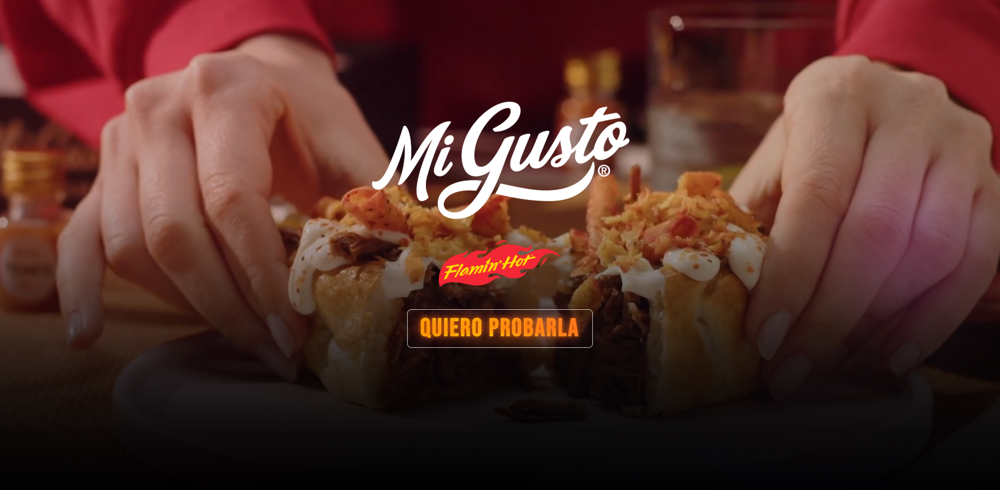
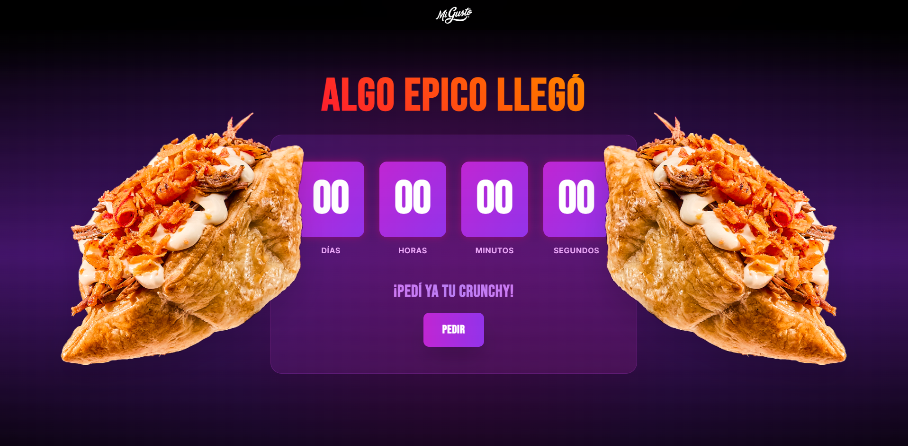
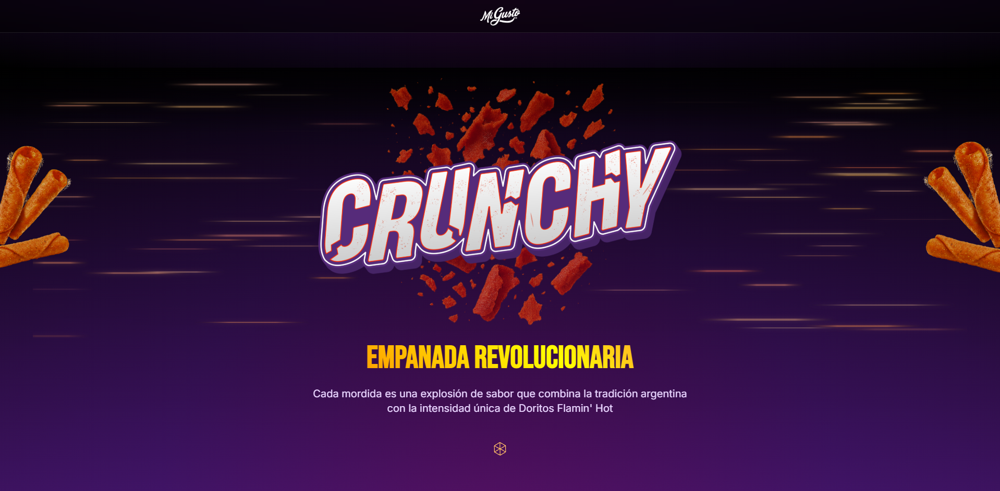
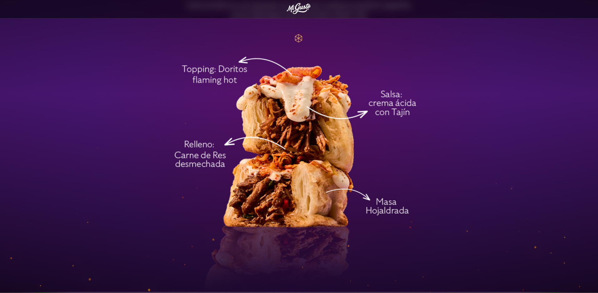
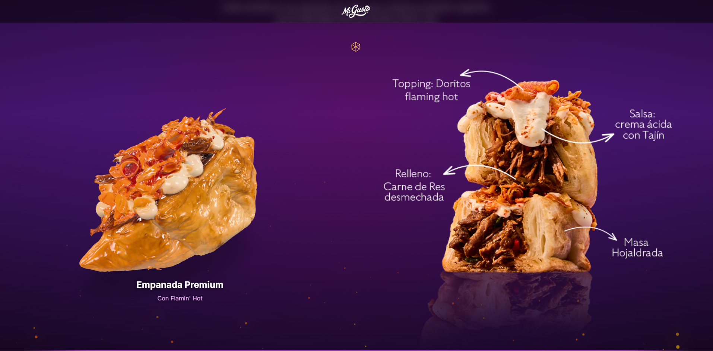

   
  
  &nbsp;&nbsp;&nbsp;&nbsp;&nbsp;&nbsp;&nbsp;&nbsp;
  
    

  # 🌶️ Mi Gusto x Doritos Flamin' Hot — CRUNCHY 🔥

  

    <b>Micrositio promocional e interactivo de alto impacto visual diseñado para el lanzamiento oficial de la empanada CRUNCHY.</b>
     
    Una experiencia inmersiva que combina animaciones dinámicas, renderizado 3D en tiempo real y medición avanzada de usuario.
  

  

    
  

  

    
    
    
    
    
    
    
  

  ---

## 📌 Sobre el Proyecto

Durante un mes y medio de trabajo colaborativo e iterativo entre el equipo de desarrollo y el departamento de Marketing, diseñamos y construimos una experiencia web responsiva orientada a cautivar a los consumidores de **Mi Gusto** y **Doritos Flamin' Hot**. 

A través de continuas pruebas estéticas, optimización de efectos y ajuste fino de interacciones, logramos transmitir el concepto picante, crocante e innovador de la empanada **CRUNCHY**.

---

## 📸 Galería del Proyecto

  <table>
    <tr>
      <td width="50%" align="center">
        
      </td>
      <td width="50%" align="center">
        
      </td>
    </tr>
    <tr>
      <td width="50%" align="center">
        
      </td>
      <td width="50%" align="center">
        
      </td>
    </tr>
    <tr>
      <td colspan="2" align="center">
        
      </td>
    </tr>
  </table>

---

## ✨ Características Principales

- **Hero Dinámico & CTA Animado**: Cabecera con reproducción de video continuo, efectos de capas visuales y llamada a la acción embebida mediante Lottie.
- **Visualizador 3D Interactivo**: Integración del modelo 3D oficial (`.glb`) con `model-viewer`, permitiendo rotación e inspección del producto en tiempo real, optimizado con carga diferida (lazy loading).
- **Efectos de Partículas y Canvas**: Fondo interactivo de llamas mediante Canvas API renderizado eficientemente para dispositivos móviles y escritorio.
- **Sección de Ingredientes**: Revelado progresivo impulsado por `IntersectionObserver` y micro-animaciones fluidas.
- **Explosión de Chips & Confetti**: Superposición de efectos visuales que refuerzan el impacto del producto en puntos clave de interacción.
- **Medición & Tracking GA4 Avanzado**: Trazabilidad completa de eventos, clics en CTAs, tiempo de atención y navegación por componentes.

---

## 🛠️ Tecnologías Utilizadas

| Categoría | Tecnología / Librería |
| :--- | :--- |
| **Core Framework** | React 18 + TypeScript |
| **Bundler & Build** | Vite 5 |
| **Estilos & UI** | Tailwind CSS 3 + Vanilla CSS |
| **Visualización 3D** | Google `model-viewer` + `gltf-pipeline` |
| **Animaciones & FX** | Lottie + Canvas API (Fuego & Partículas) |
| **Backend & Data** | Supabase JS |
| **Analítica** | Google Analytics 4 (GA4 auto-tracking) |
| **Optimización Assets** | `imagemin-cli` (mozjpeg / pngquant / WebP) |

---

## 👥 Créditos y Desarrollo

Este proyecto fue desarrollado por:

- **Facundo Carrizo** — [GitHub](https://github.com/facu14carrizo) · [LinkedIn](https://www.linkedin.com/in/facu14carrizo)
- **Ramiro Lacci** — [GitHub](https://github.com/ramirolacci19) · [LinkedIn](https://www.linkedin.com/in/ramiro-lacci)

---

## 📄 Licencia

© 2025 **Mi Gusto**. Todos los derechos reservados. Proyecto privado desarrollado para uso comercial de la marca.

*Mi Gusto ® es una marca registrada de La Honoria Alimentos SA - Argentina.*
